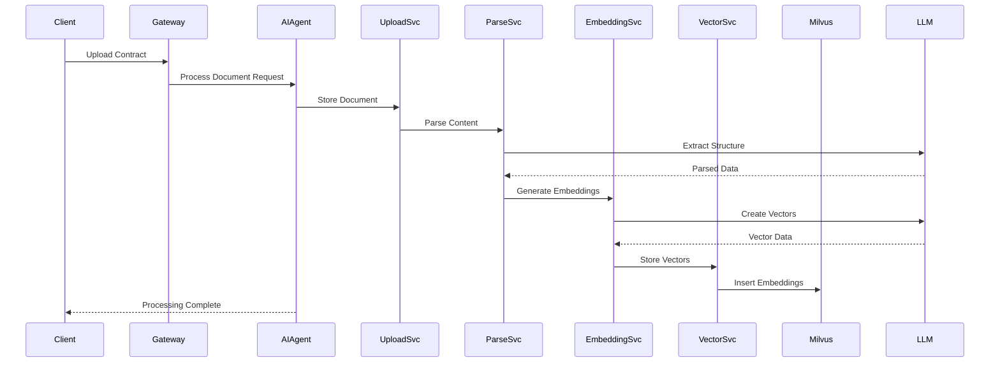
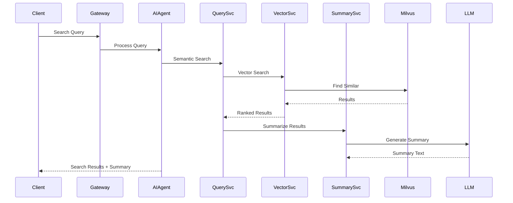

# Contract Processing System Architecture

## System Overview
```mermaid
graph TB
    subgraph "Client Layer"
        UI[Web UI/Dashboard]
        API_CLIENT[API Clients]
    end

    subgraph "Gateway Layer"
        GATEWAY[API Gateway]
    end

    subgraph ".NET Aspire Orchestration"
        APPHOST[Aspire AppHost]
        
        subgraph "Core Services"
            UPLOAD_SVC[Document Upload Service]
            PARSE_SVC[Document Parsing Service]
            EMBEDDING_SVC[Embedding Service]
            QUERY_SVC[Query Service]
            SUMMARY_SVC[Summarization Service]
        end
        
        subgraph "AI Orchestration"
            AI_AGENT[AI Agent Orchestrator]
            WORKFLOW[Workflow Engine]
        end
        
        subgraph "Data Services"
            VECTOR_SVC[Vector Database Service]
            STORAGE_SVC[Document Storage Service]
        end
    end

    subgraph "External AI Services"
        LLM_API[LLM API (OpenAI/Azure)]
        EMBEDDING_API[Embedding API]
    end

    subgraph "Data Storage"
        MILVUS[(Milvus Vector DB)]
        BLOB_STORAGE[(Azure Blob Storage)]
        SQL_DB[(SQL Database)]
    end

    subgraph "Infrastructure"
        REDIS[(Redis Cache)]
        MESSAGE_QUEUE[Message Queue]
    end

    %% Client connections
    UI --> GATEWAY
    API_CLIENT --> GATEWAY

    %% Gateway to services
    GATEWAY --> AI_AGENT

    %% AI Agent orchestration
    AI_AGENT --> UPLOAD_SVC
    AI_AGENT --> PARSE_SVC
    AI_AGENT --> EMBEDDING_SVC
    AI_AGENT --> QUERY_SVC
    AI_AGENT --> SUMMARY_SVC
    AI_AGENT --> WORKFLOW

    %% Service connections
    UPLOAD_SVC --> STORAGE_SVC
    UPLOAD_SVC --> PARSE_SVC
    PARSE_SVC --> LLM_API
    PARSE_SVC --> EMBEDDING_SVC
    EMBEDDING_SVC --> EMBEDDING_API
    EMBEDDING_SVC --> VECTOR_SVC
    QUERY_SVC --> VECTOR_SVC
    QUERY_SVC --> LLM_API
    SUMMARY_SVC --> LLM_API

    %% Data connections
    STORAGE_SVC --> BLOB_STORAGE
    VECTOR_SVC --> MILVUS
    UPLOAD_SVC --> SQL_DB
    PARSE_SVC --> SQL_DB

    %% Infrastructure
    AI_AGENT --> REDIS
    WORKFLOW --> MESSAGE_QUEUE

    %% Aspire orchestration
    APPHOST --> UPLOAD_SVC
    APPHOST --> PARSE_SVC
    APPHOST --> EMBEDDING_SVC
    APPHOST --> QUERY_SVC
    APPHOST --> SUMMARY_SVC
    APPHOST --> AI_AGENT
    APPHOST --> VECTOR_SVC
    APPHOST --> STORAGE_SVC
    APPHOST --> MILVUS
    APPHOST --> REDIS
    APPHOST --> SQL_DB
```

## Detailed Architecture Components

### 1. Client Layer
- **Web UI/Dashboard**: React/Blazor frontend for contract management
- **API Clients**: External applications accessing the contract processing APIs

### 2. .NET Aspire Orchestration
- **AppHost**: Central orchestrator managing all services and dependencies
- **Service Discovery**: Automatic service registration and discovery
- **Configuration Management**: Centralized configuration across all services

### 3. Core Services

#### Document Upload Service
- Handles file uploads (PDF, DOC, DOCX)
- File validation and virus scanning
- Metadata extraction
- Storage coordination

#### Document Parsing Service
- AI-powered content extraction
- Structure analysis (clauses, terms, conditions)
- Entity recognition (dates, amounts, parties)
- OCR for scanned documents

#### Embedding Service
- Text chunking strategies
- Vector generation using LLM APIs
- Batch processing for large documents
- Embedding optimization

#### Query Service
- Semantic search across contract collection
- Multi-modal queries (text + metadata)
- Relevance scoring and ranking
- Search result aggregation

#### Summarization Service
- Contract summary generation
- Key terms extraction
- Risk assessment
- Comparison analysis

### 4. AI Agent Orchestrator
- **Workflow Coordination**: Manages complex multi-step processes
- **Context Management**: Maintains conversation and processing state
- **Decision Engine**: Routes requests to appropriate services
- **Error Handling**: Implements retry logic and fallback strategies

### 5. Data Layer

#### Vector Database (Milvus)
- High-performance vector storage and retrieval
- Similarity search optimization
- Index management
- Scalable vector operations

#### Document Storage
- Azure Blob Storage for file persistence
- Content delivery network integration
- Backup and archival policies

#### Metadata Database
- SQL Server for structured data
- Document metadata and relationships
- User management and permissions
- Audit trails

## Data Flow Diagrams

### Contract Upload and Processing Flow


### Query and Summarization Flow


## Technology Stack

### .NET Aspire Components
- **Aspire.Hosting**: Service orchestration and dependency management
- **Aspire.ServiceDefaults**: Common configurations and telemetry
- **Aspire.Azure.Storage.Blobs**: Blob storage integration
- **Aspire.StackExchange.Redis**: Caching and session management

### AI/ML Integration
- **Azure OpenAI Service**: GPT models for parsing and summarization
- **OpenAI .NET SDK**: API client for LLM interactions
- **Microsoft.ML**: Local ML processing capabilities
- **Semantic Kernel**: AI orchestration and prompt engineering

### Vector Database
- **Milvus**: Primary vector storage and search
- **Milvus .NET SDK**: Database connectivity
- **FAISS**: Optional local vector operations

### Supporting Services
- **PostgreSQL**: Metadata and user data
- **Redis**: Caching and real-time features
- **Azure Service Bus**: Message queuing
- **Serilog**: Structured logging
- **OpenTelemetry**: Observability and monitoring

## Deployment Architecture

### Development Environment
```yaml
services:
  - contract-api (Port: 5000)
  - document-parser (Port: 5001)
  - embedding-service (Port: 5002)
  - vector-service (Port: 5003)
  - ai-agent (Port: 5004)
  - milvus (Port: 19530)
  - postgresql (Port: 5432)
  - redis (Port: 6379)
```

### Production Considerations
- **Container Orchestration**: Kubernetes or Azure Container Apps
- **Load Balancing**: Azure Application Gateway
- **Scaling**: Horizontal pod autoscaling based on metrics
- **Security**: Azure Key Vault for secrets management
- **Monitoring**: Application Insights and Prometheus
- **Backup**: Automated database and vector store backups

## Performance Characteristics

### Expected Throughput
- **Document Upload**: 100 documents/minute
- **Vector Search**: 1000 queries/second
- **Embedding Generation**: 50 documents/minute
- **Summarization**: 200 summaries/minute

### Latency Targets
- **Search Queries**: < 500ms p95
- **Document Upload**: < 2s for 10MB files
- **Summarization**: < 3s for standard contracts
- **Embedding Generation**: < 10s per document

## Security Framework

### Authentication & Authorization
- **Azure AD B2C**: User authentication
- **JWT Tokens**: Stateless authorization
- **Role-Based Access**: Document-level permissions
- **API Keys**: Service-to-service authentication

### Data Protection
- **Encryption at Rest**: All stored documents
- **TLS 1.3**: All network communications
- **PII Detection**: Automatic sensitive data identification
- **Data Retention**: Configurable retention policies